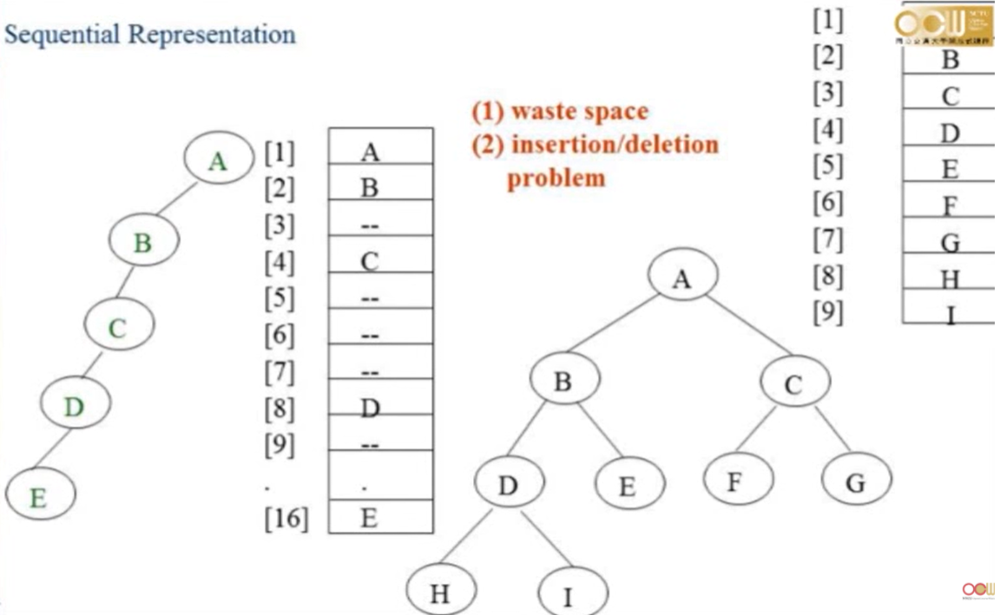
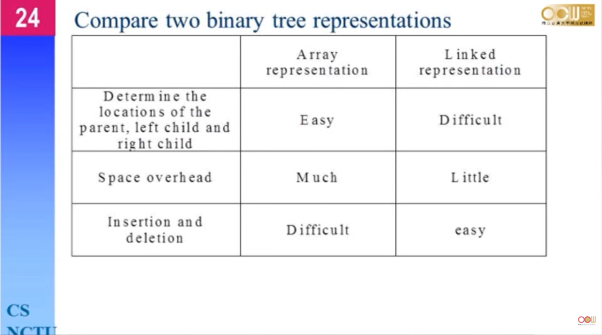

第七週	Trees (1/6)
## 名詞定義
degree (分歧度): 一個node能指向幾個node

### 實現與結構
Tree的表現方式可以用LikedList來表示，但是會浪費太多的pointer的空間，例如有個degree為k，node數目為n的tree，會預先準備n*k個pointer，但是實際上只有每個node會被一個ponter指到，除了root以外，因此實際上浪費了n*k-(n-1)個pointer空間，為了解決這個問題，可用left-subing的方式或是binary tree來表示它

## binary tree
full binary tree: 擁有最大量node的二元樹，表示每個node都有指向兩個node。
complete binary tree: node沒有到達最大量數量，但每個node指向的node的數量為0或為2。

#### 使用array表示binary tree

但當遇到skew tree時，會浪費太多空間，雖然用array很容易做查詢。

#### 比較用LinkedList和array實現樹

### Binary Tree Traversals

這裡再另外補充: 
LVR
VLR
LRV
1. inorder traversal : 走到不能往左邊走，就return，
return後把值(parent)印出來後，往右邊走。

可以用recusive的方式去實作，也可以用stack實現。

2. preorder : 先把值印出來才往下走。
3. postrder: 最後才把值印出來。
4. Level-order : 把同一層的node都先印出來，可以用queue實現，將所有child node放入queue直到沒有child

